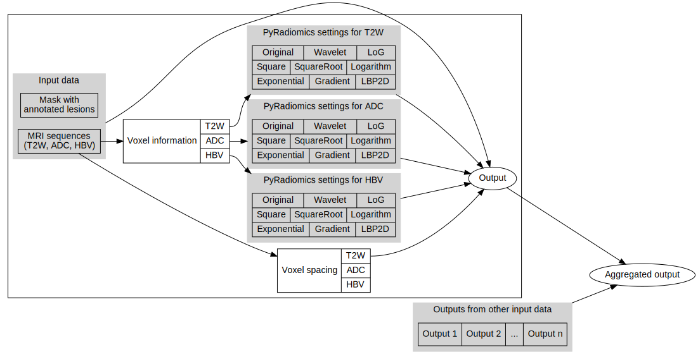

# Radiomic feature extraction pipeline

*With help from Ana Caroline Rodrigues*

Here I include scripts for the automated registration of images belonging to the same study and the consequent extraction of radiomic features from them.

## Extraction using `utils/extract-radiomic-features.py`

This script constitutes the powerhouse of the feature extraction. It assumes that all the input modalities (1 or more) can be mapped to the mask (1) and it can easily perform registration of images using the `--registration` flag. In all cases, this script resamples images to a common spacing (that of the fixed image, depending on the `--registration` flag):

* `--registration mask` - assumes that the first image with the same shape as the mask is the fixed image
* `--registration largest` - registers the image to the largest shape available after resampling
* `--registration first` - assumes that the first image in the `--input_paths` is the fixed image
* `--registration none` - resamples all images to first in the `--input_paths`. This step is performed with the fixed image for all other registration methods

The `--assume_same` flag assumes that no registration is required if moving images/masks have the same shape as the fixed image (i.e. they are already aligned).

```
usage: extract-radiomic-features.py [-h] --input_paths INPUT_PATHS [INPUT_PATHS ...] --configs CONFIGS [CONFIGS ...] --mask_path MASK_PATH --target_spacing TARGET_SPACING [TARGET_SPACING ...] --output_path OUTPUT_PATH [--registration {mask,largest,first}] [--assume_same]

Extracts features for a given set of sequences and a single mask. In case the sequences or the mask are of different sizes, it maps all of the sequences to a common space given as input. Optionally, this script also registers all sequences assuming that the first sequence is the reference. The mask may also be registered if its input size is different from that of the first input sequence.

options:
  -h, --help            show this help message and exit
  --input_paths INPUT_PATHS [INPUT_PATHS ...]
                        Paths to sequences in nibabel compatible format.
  --configs CONFIGS [CONFIGS ...]
                        Paths to pyradiomics configuration files.
  --mask_path MASK_PATH
                        Path to mask in nibabel compatible format.
  --target_spacing TARGET_SPACING [TARGET_SPACING ...]
                        Target spacing for the inputs/mask.
  --output_path OUTPUT_PATH
                        Output path.
  --registration {mask,largest,first,none}
                        Registers all images to an image with the shape of the mask or to the largest image (registration is inferred from the first non-fixed image and
                        applied to other images).
  --assume_same         
                        Assumes that if fixed and moving images/masks have the same shape they are already co-registered (or equivalent)  . Only for registration == 'first'.
```

## Extraction using Snakemake

To extract features using the Snakemake pipeline (specified in `get-radiomic-features-pi-cai.smk`), one needs to edit `config.yaml` (the Snakemake `configfile`) such that it contains the correct values. The one presented here was used on data from PI-CAI. I also present `config-no-reg.yaml`, a configuration file for feature extraction with no registration.

This pipeline works as follows:

1. Extraction of all the relevant and image-specific parameters from the images (particularly minimum and maximum voxel values and bin widths assuming that the user is interested in 100 bins) as they are required for the `pyradiomics` package using `utils/get-voxel-bins.py` (this step is fairly time consuming but is generic across datasets). The output is stored in `dataset_information_path`
2. Production of settings files with the output of 1 using the `utils/voxel-features-to-radiomics-settings.py`. The output is stored in `radiomics_settings_path`
3. Getting the spacing for all datasets (this will be used to resample the input images to a common spacing - that corresponding to the first `key` in `pattern` in the `configfile` - before feature extraction). The output is stored in `dataset_information_path`
4. Extract features from the input images using `utils/extract-radiomic-features.py`. The outputs are stored as JSON files in `radiomic_features_path`
5. Aggregate all features into a single CSV file. The output is stored in `aggregated_features_path`

A visualization of this pipeline using GraphViz is presented below.

